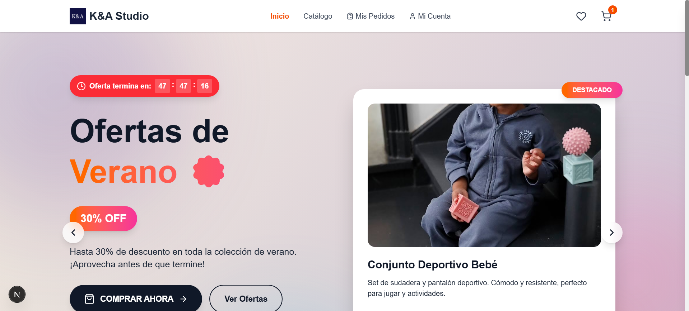
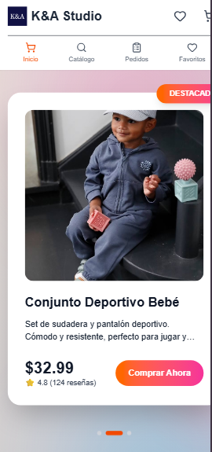

E-Commerce Store – Frontend Portfolio Project

A modern and fully featured e-commerce frontend application built with Next.js 14, React 18, and TypeScript, focused on clean architecture, scalable state management, and a polished user experience.

This project is part of my frontend portfolio and showcases advanced UI/UX design, reusable components, and real-world e-commerce functionality.

✨ Live Demo

🛒 View the project live: https://ecommerce-store-xi-one.vercel.app/

()
()

🚀 Features

- Product catalog with search, filters, and sorting

- Shopping cart with persistent state (localStorage)

- Favorites system

- Product details with image gallery and related items

- Quick view modal

- Checkout flow with discounts and shipping options

- Order history

- Fully responsive, mobile-first UI

- Smooth animations and loading states

🧠 Project Structure

src/
├── app/
│ ├── globals.css # Global styles and animations
│ ├── layout.tsx # Root layout
│ ├── page.tsx # Home page
│ └── types.ts # Global TypeScript types
│
├── components/
│ ├── Header.tsx # Main navigation
│ ├── Footer.tsx # Site footer
│ ├── Hero.tsx # Hero section with carousel
│ ├── ProductoCard.tsx # Product card component
│ ├── ModalProducto.tsx # Quick view modal
│ ├── CarritoPanel.tsx # Shopping cart panel
│ ├── Checkout.tsx # Checkout flow
│ ├── Favoritos.tsx # Favorites page
│ ├── MisPedidos.tsx # Order history
│ ├── SkeletonLoader.tsx # Loading states
│ └── Toast.tsx # Notifications system
│
├── data/
│ ├── productos.ts # Product catalog
│ └── ProductosMejorados.ts
│
└── store/
└── useStore.ts # Global state (Zustand)

⚙️ Tech Stack

- Next.js

- React

- TypeScript

- Tailwind CSS

- Lucide React (icons)

🧩 Key Implementation Details

- Global state management with Zustand

- Persistent cart and favorites using localStorage

- Reusable and modular component architecture

- Optimized image loading and performance

- Responsive UI designed mobile-first

- Clean separation between UI, state, and data

🛠 Installation & Usage

npm install
npm run dev

🎯 Project Purpose

This project was built to:

Demonstrate advanced frontend skills with React and Next.js

Showcase real-world e-commerce features

Apply scalable state management patterns

Present a polished, production-style UI

Serve as a key project in my frontend developer portfolio

👤 Author

Andy Sebastian
Frontend Developer

GitHub: https://github.com/andydevsoftware

Portfolio: In progress

⭐ Future Improvements

Authentication and user accounts

Backend integration (API / database)

Payment gateway integration

Full dark / light theme toggle

Admin dashboard for product management
